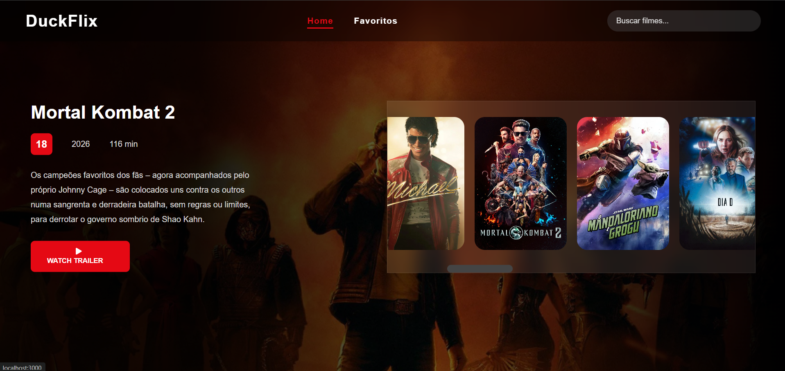
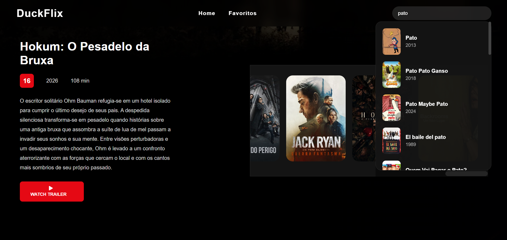
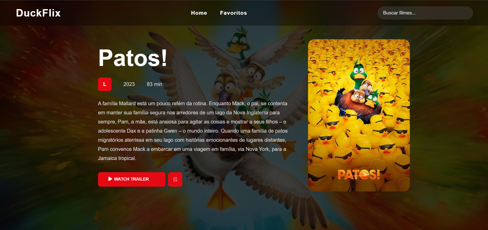
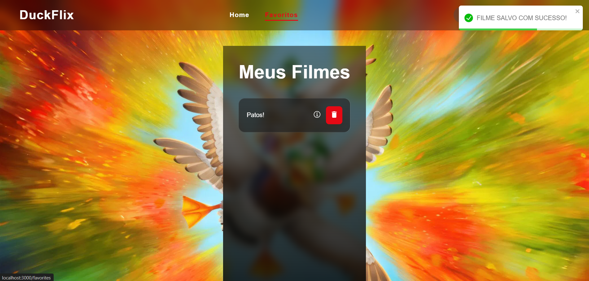

# 🎬 DuckFlix


DuckFlix is a movie streaming-inspired web application built with React and powered by the TMDB API. Users can browse currently playing movies, search for titles in real time, view detailed information, watch trailers, and manage a personalized favorites list.

## 🚀 Features

- 🎥 Browse currently playing movies
- 🔍 Real-time movie search with suggestions
- 📄 Detailed movie information page
- ▶️ Watch official movie trailers
- ❤️ Add and remove movies from favorites
- 💾 Favorites persistence using LocalStorage
- 🎨 Modern streaming platform-inspired UI
- 📱 Responsive design
- 🔄 Automatic movie carousel

## 🛠️ Technologies Used

- React
- React Router DOM
- Axios
- CSS3
- React Icons
- TMDB API
- LocalStorage

## 📂 Project Structure

```bash
src/
├── components/
│   ├── Header/
│   ├── Hero/
│   └── MovieCard/
│
├── pages/
│   ├── Home/
│   ├── Movie/
│   └── Favorites/
│
├── services/
│   └── api.js
│
├── routes.js
└── App.js
```

## 📸 Screenshots

Add screenshots of your application here:

### Home Page



### Search Box



### Movie Details



### Favorites



## ⚙️ Installation

Clone the repository:

```bash
git clone https://github.com/YOUR_USERNAME/duckflix.git
```

Navigate to the project folder:

```bash
cd duckflix
```

Install dependencies:

```bash
npm install
```

Start the development server:

```bash
npm start
```

## 🔑 Environment Variables

Create a `.env` file in the root directory and add your TMDB API key:

```env
REACT_APP_TMDB_KEY=your_api_key_here
```

For Vite projects:

```env
VITE_TMDB_KEY=your_api_key_here
```

## 🌐 API Reference

This project uses:

- The Movie Database (TMDB)

Official documentation:

https://developer.themoviedb.org/docs

## 🎯 Future Improvements

- User authentication
- Dark/Light theme toggle
- Advanced filtering
- Pagination
- Watchlist feature
- Actor and cast information
- Movie recommendations

## 👨‍💻 Author

**Breno Castro**

Frontend Developer in training, focused on building modern web applications using React and JavaScript.

## 📫 Contact

- GitHub: https://github.com/wizardduck
- LinkedIn: https://www.linkedin.com/in/brenocastro7/

---

⭐ If you enjoyed this project, consider giving it a star on GitHub!